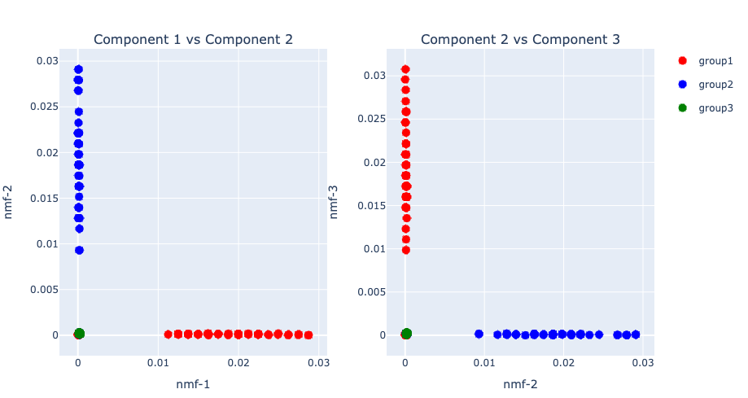
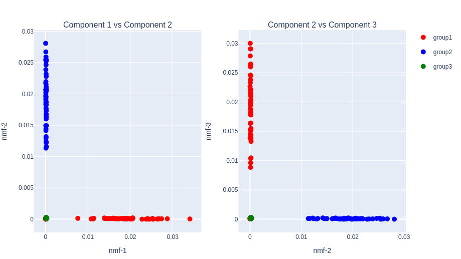
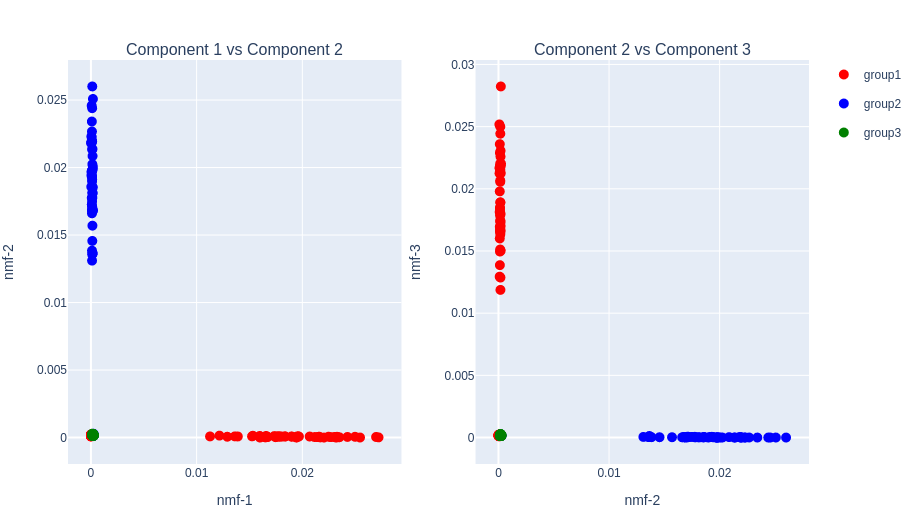
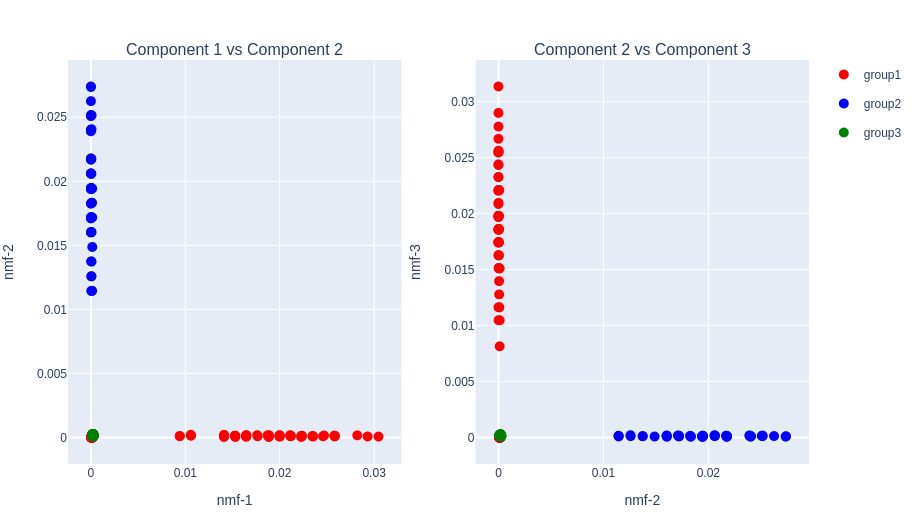
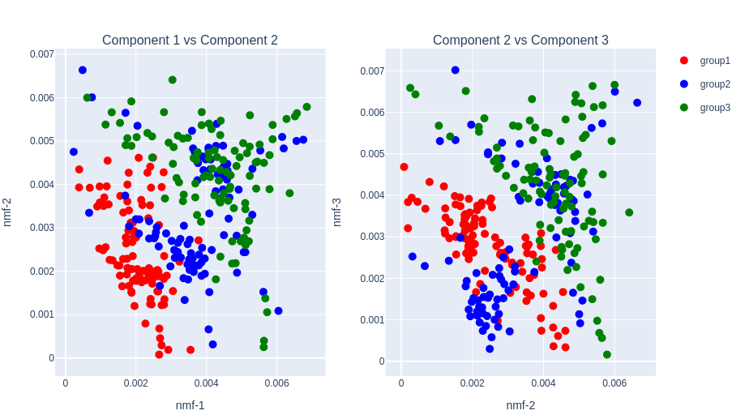
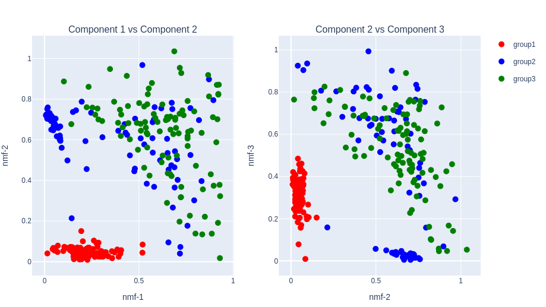

# OnlineNMF.jl
Online Non-negative Matrix Factorization

[](https://github.com/rikenbit/OnlineNMF.jl/actions/workflows/CI.yml?query=branch%3Amaster)
[](https://doi.org/10.5281/zenodo.8199413)

## 📚 Documentation
[](https://rikenbit.github.io/OnlineNMF.jl/dev)

## Description
OnlineNMF.jl performs some online-NMF functions for extreamly large scale matrix.

## Algorithms

- Multiplicative Update (MU)
  - Alpha-divergence: [Cichocki, A. et al., 2008](https://www.sciencedirect.com/science/article/pii/S0167865508000767)
    - Alpha=2 : Pearson divergence-based NMF
    - Alpha=0 or 1 : Kullback–Leibler (KL) divergence-based NMF
    - Alpha=0.5 : Hellinger divergence-based NMF
  - Beta-divergence: [Févotte, C. et al., 2011](https://ieeexplore.ieee.org/document/6795238), [Nakano, M. et al., 2010](https://ieeexplore.ieee.org/document/5589233)
    - Beta=2 : Euclidean distance-based NMF with Gaussian distribution
    - Beta=1 : Kullback–Leibler divergence-based NMF with Poisson distribution
    - Beta=0 : Itakura-Saito divergence-based NMF with Gamma distribution
- Discretized Non-negative Matrix Factorization (DNMF): [Koki Tsuyuzaki, 2023](https://joss.theoj.org/papers/10.21105/joss.05664)

## Installation
<!-- ```julia
julia> using Pkg
julia> Pkg.add(url="https://github.com/rikenbit/OnlinePCA.jl.git")
julia> Pkg.add(url="https://github.com/rikenbit/OnlineNMF.jl.git")
julia> Pkg.add("PlotlyJS")
```
 -->
```julia
# push the key "]" and type the following command.
(@julia) pkg> add https://github.com/rikenbit/OnlinePCA.jl
(@julia) pkg> add https://github.com/rikenbit/OnlineNMF.jl
(@julia) pkg> add PlotlyJS
# After that, push Ctrl + C to leave from Pkg REPL mode
```

## Basic API usage
### Preprocess of CSV
```julia
using OnlinePCA
using OnlinePCA: write_csv
using OnlineNMF
using Distributions
using DelimitedFiles
using SparseArrays
using MatrixMarket

# CSV
tmp = mktempdir()
data = rand(Binomial(10, 0.05), 300, 99)
data[1:50, 1:33] .= 100*data[1:50, 1:33]
data[51:100, 34:66] .= 100*data[51:100, 34:66]
data[101:150, 67:99] .= 100*data[101:150, 67:99]
write_csv(joinpath(tmp, "Data.csv"), data)

# Matrix Market (MM)
mmwrite(joinpath(tmp, "Data.mtx"), sparse(data))

# Binary COO (BinCOO)
data2 = zeros(Int, 300, 99)
data2[1:50, 1:33] .= 1
data2[51:100, 34:66] .= 1
data2[101:150, 67:99] .= 1
data2[151:300, :] .= 1

bincoofile = joinpath(tmp, "Data.bincoo")
open(bincoofile, "w") do io
    for i in 1:size(data2, 1)
        for j in 1:size(data2, 2)
            if data2[i, j] != 0
                println(io, "$i $j")
            end
        end
    end
end

# Binarization (Zstandard)
csv2bin(csvfile=joinpath(tmp, "Data.csv"), binfile=joinpath(tmp, "Data.zst"))

# Sparsification (Zstandard + MM format)
mm2bin(mmfile=joinpath(tmp, "Data.mtx"), binfile=joinpath(tmp, "Data.mtx.zst"))

# Binarziation (BinCOO + Zstandard)
bincoo2bin(bincoofile=bincoofile, binfile=joinpath(tmp, "Data.bincoo.zst"))
```

### Setting for plot
```julia
using DataFrames
using PlotlyJS

function subplots(out_nmf, group)
	# data frame
	data_left = DataFrame(nmf1=out_nmf[1][:,1], nmf2=out_nmf[1][:,2], group=group)
	data_right = DataFrame(nmf2=out_nmf[1][:,2], nmf3=out_nmf[1][:,3], group=group)
	# plot
	p_left = Plot(data_left, x=:nmf1, y=:nmf2, mode="markers", marker_size=10, group=:group)
	p_right = Plot(data_right, x=:nmf2, y=:nmf3, mode="markers", marker_size=10,
	group=:group, showlegend=false)
	p_left.data[1]["marker_color"] = "red"
	p_left.data[2]["marker_color"] = "blue"
	p_left.data[3]["marker_color"] = "green"
	p_right.data[1]["marker_color"] = "red"
	p_right.data[2]["marker_color"] = "blue"
	p_right.data[3]["marker_color"] = "green"
	p_left.data[1]["name"] = "group1"
	p_left.data[2]["name"] = "group2"
	p_left.data[3]["name"] = "group3"
	p_left.layout["title"] = "Component 1 vs Component 2"
	p_right.layout["title"] = "Component 2 vs Component 3"
	p_left.layout["xaxis_title"] = "nmf-1"
	p_left.layout["yaxis_title"] = "nmf-2"
	p_right.layout["xaxis_title"] = "nmf-2"
	p_right.layout["yaxis_title"] = "nmf-3"
	plot([p_left p_right])
end

group=vcat(repeat(["group1"],inner=100), repeat(["group2"],inner=100), repeat(["group3"],inner=100))
```

### NMF based on Alpha-Divergence
```julia
out_nmf_alpha = nmf(input=joinpath(tmp, "Data.zst"), dim=3, alpha=1, numepoch=30, algorithm="alpha")

subplots(out_nmf_alpha, group)
```


### NMF based on Beta-Divergence
```julia
out_nmf_beta = nmf(input=joinpath(tmp, "Data.zst"), dim=3, beta=2, numepoch=30, algorithm="beta")

subplots(out_nmf_beta, group)
```


### Semi-Binary MF based on Beta-Divergence
```julia
out_dnmf_beta = dnmf(input=joinpath(tmp, "Data.zst"), dim=3, beta=1, numepoch=30, binu=10^2)
minimum(out_dnmf_beta[1])
maximum(out_dnmf_beta[1])

subplots(out_dnmf_beta, group)
```


### Sparse-NMF based on Alpha-Divergence
```julia
out_sparse_nmf_alpha = sparse_nmf(input=joinpath(tmp, "Data.mtx.zst"), dim=3, alpha=1, numepoch=30, algorithm="alpha")

subplots(out_sparse_nmf_alpha, group)
```


### Sparse-NMF based on Beta-Divergence
```julia
out_sparse_nmf_beta = sparse_nmf(input=joinpath(tmp, "Data.mtx.zst"), dim=3, beta=2, numepoch=30, algorithm="beta")

subplots(out_sparse_nmf_beta, group)
```


### Sparse-DNMF based on Beta-Divergence
```julia
out_sparse_dnmf_beta = sparse_dnmf(input=joinpath(tmp, "Data.mtx.zst"), dim=3, beta=1, numepoch=30, binu=10^2)
minimum(out_sparse_dnmf_beta[1])
maximum(out_sparse_dnmf_beta[1])

subplots(out_sparse_dnmf_beta, group)
```


### BinCOO-NMF based on Alpha-Divergence
```julia
out_bincoo_nmf_alpha = bincoo_nmf(input=joinpath(tmp, "Data.bincoo.zst"), dim=3, alpha=1, numepoch=10, algorithm="alpha")

subplots(out_bincoo_nmf_alpha, group)
```


### BinCOO-NMF based on Beta-Divergence
```julia
out_bincoo_nmf_beta = bincoo_nmf(input=joinpath(tmp, "Data.bincoo.zst"), dim=3, beta=1, numepoch=10, algorithm="beta")

subplots(out_bincoo_nmf_beta, group)
```


### BinCOO-NMF based on Beta-Divergence
```julia
out_bincoo_dnmf_beta = bincoo_dnmf(input=joinpath(tmp, "Data.bincoo.zst"), dim=3, beta=1, numepoch=10, binu=10^2)
minimum(out_bincoo_dnmf_beta[1])
maximum(out_bincoo_dnmf_beta[1])

subplots(out_bincoo_dnmf_beta, group)
```


## Command line usage
The type of input file is assumed to be CSV or MM formats, and then be processed by `csv2bin` or `mm2bin` in `OnlinePCA` package. The binary file is specified as the input of NMF functions in `OnlineNMF` package. The NMF functions also can be performed as command line tools with same parameter names like below.

```bash
# CSV → Julia Binary
julia YOUR_HOME_DIR/.julia/v0.x/OnlinePCA/bin/csv2bin \
    --csvfile Data.csv --binfile Data.zst

# MM → Julia Binary
julia YOUR_HOME_DIR/.julia/v0.x/OnlinePCA/bin/mm2bin \
    --mmfile Data.mtx --binfile Data.mtx.zst

# BinCOO → Julia Binary
julia YOUR_HOME_DIR/.julia/v0.x/OnlinePCA/bin/bincoo2bin \
    --mmfile Data.bincoo --binfile Data.bincoo.zst

# NMF based on Alpha-Divergence
julia YOUR_HOME_DIR/.julia/v0.x/OnlineNMF/bin/nmf \
    --input Data.zst --dim 3 \
    --numepoch 10 --alpha 1

# NMF based on Beta-Divergence
julia YOUR_HOME_DIR/.julia/v0.x/OnlineNMF/bin/nmf \
    --input Data.zst --dim 3 \
    --numepoch 10 --beta 2

# DNMF based on Beta-Divergence
julia YOUR_HOME_DIR/.julia/v0.x/OnlineNMF/bin/dnmf \
    --input Data.zst --dim 3 \
    --numepoch 10 --beta 2

# Sparse-NMF based on Alpha-Divergence
julia YOUR_HOME_DIR/.julia/v0.x/OnlineNMF/bin/sparse_nmf \
    --input Data.mtx.zst --dim 3 \
    --numepoch 10 --alpha 1

# Sparse-NMF based on Beta-Divergence
julia YOUR_HOME_DIR/.julia/v0.x/OnlineNMF/bin/sparse_nmf \
    --input Data.mtx.zst --dim 3 \
    --numepoch 10 --beta 2

# Sparse-DNMF based on Beta-Divergence
julia YOUR_HOME_DIR/.julia/v0.x/OnlineNMF/bin/sparse_dnmf \
    --input Data.mtx.zst --dim 3 \
    --numepoch 10 --beta 2

# BinCOO-NMF based on Alpha-Divergence
julia YOUR_HOME_DIR/.julia/v0.x/OnlineNMF/bin/bincoo_nmf \
    --input Data.bincoo.zst --dim 3 \
    --numepoch 10 --alpha 1

# BinCOO-NMF based on Beta-Divergence
julia YOUR_HOME_DIR/.julia/v0.x/OnlineNMF/bin/bincoo_nmf \
    --input Data.bincoo.zst --dim 3 \
    --numepoch 10 --beta 2

# BinCOO-DNMF based on Beta-Divergence
julia YOUR_HOME_DIR/.julia/v0.x/OnlineNMF/bin/bincoo_dnmf \
    --input Data.bincoo.zst --dim 3 \
    --numepoch 10 --beta 2
```

## Contributing

If you have suggestions for how `OnlineNMF.jl` could be improved, or want to report a bug, open an issue! We'd love all and any contributions.

For more, check out the [Contributing Guide](CONTRIBUTING.md).

## Author
- Koki Tsuyuzaki