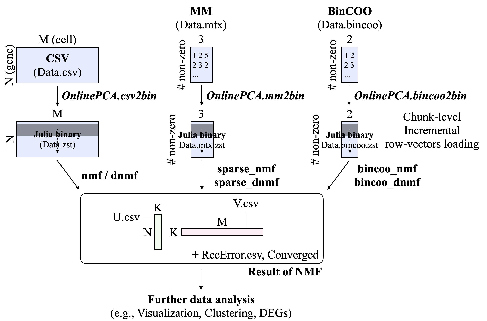

# OnlineNMF.jl Documentation
## Overview
OnlineNMF.jl binarizes CSV file, summarizes the information of data matrix and, performs some online-NMF functions for extreamly large scale matrix in an out-of-core manner without loading whole data on memory space.

Online NMF methods are performed as following two steps.

- **Step.1 Binarization** : We asssume that the data is matrix filled in integar count value and saved as comma-separated CSV, Matrix Market (MM), or Binary COO (BinCOO) file. Using `OnlinePCA` package, These files are converted to Julia binary file by `csv2bin`, `mm2bin` or `bincoo2bin`, respectively. This step extremely accelerates I/O speed. 
- **Step.2 Online NMF** : `nmf` and `dnmf` can be perfomed against the binary file generated by `csv2bin`. `sparse_nmf` and `sparse_dnmf` can be perfomed against the binary file generated by `mm2bin`. `bincoo_nmf` and `bincoo_dnmf` can be perfomed against the binary file generated by `bincoo2bin`.

All programs are available as Julia API ([OnlineNMF.jl (Julia API)](@ref)) and command line tool ([OnlineNMF.jl (Command line tool)](@ref)).

## Reference
- Multiplicative Update (MU)
  - Alpha-divergence: [Cichocki, A. et al., 2008](https://www.sciencedirect.com/science/article/pii/S0167865508000767)
    - Alpha=2 : Pearson divergence-based NMF
    - Alpha=0 or 1 : Kullback–Leibler (KL) divergence-based NMF
    - Alpha=0.5 : Hellinger divergence-based NMF
  - Beta-divergence: [Févotte, C. et al., 2011](https://ieeexplore.ieee.org/document/6795238), [Nakano, M. et al., 2010](https://ieeexplore.ieee.org/document/5589233)
    - Beta=2 : Euclidean distance-based NMF with Gaussian distribution
    - Beta=1 : Kullback–Leibler divergence-based NMF with Poisson distribution
    - Beta=0 : Itakura-Saito divergence-based NMF with Gamma distribution
- Discretized Non-negative Matrix Factorization (DNMF): [Koki Tsuyuzaki, 2023](https://joss.theoj.org/papers/10.21105/joss.05664)
