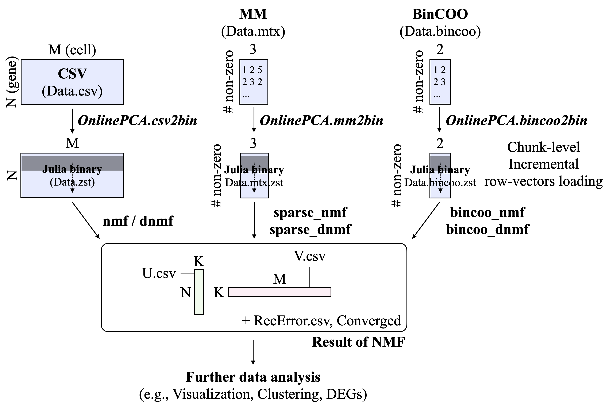
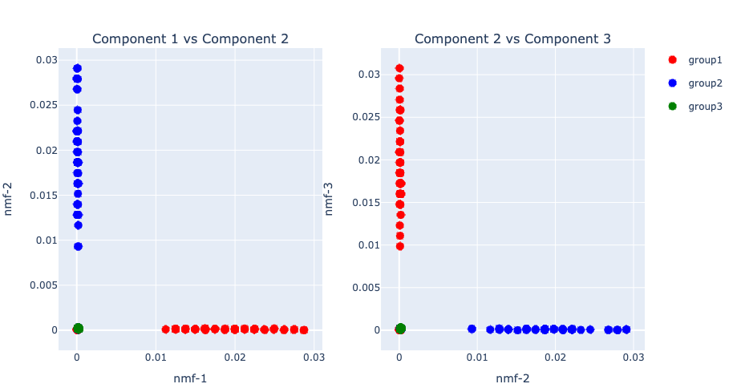
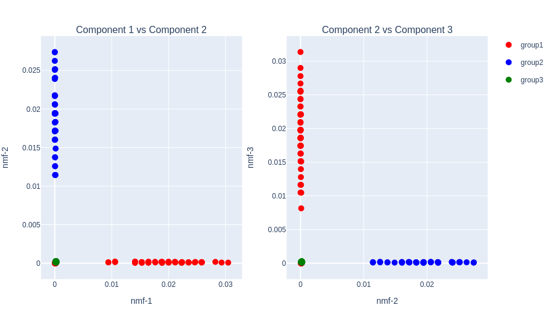

# Summary

Non-negative Matrix Factorization (NMF) is a widely used dimensionality reduction technique for identifying a small number of non-negative components that minimize the reconstruction error when applied to high-dimensional data [@review1; @review2]. NMF has been applied across various fields of data science, including face recognition [@face], audio signal processing [@audio], recommender system [@recommend], natural language processing (also known as a "topic model") [@topicmodel], population genetics (also known as "admixture analysis") [@admixture], and omics studies [@review1; @review2; @slideseq].

Despite its broad applicability, NMF becomes computationally prohibitive for large data matrices, making it difficult to apply in practice. In particular, recent advances in single-cell omics have led to datasets with millions of cells, for which standard NMF implementations often fail to scale. To meet this requirement, I present \texttt{OnlineNMF.jl}, which is a Julia package to perform some NMF algorithms (\url{https://github.com/rikenbit/OnlineNMF.jl}).

# Statement of need

NMF is a workhorse algorithm for most data science tasks. However, as the size of the data matrix increases, it often becomes too large to fit into memory. In such cases, an out-of-core (OOC) implementation — where only subsets of data stored on disk are loaded into memory for computation — is desirable. Additionally, representing the data in a sparse matrix format, where only non-zero values and their coordinates are stored, is computationally advantageous. Therefore, a NMF implementation that supports both OOC computation and sparse data handling is highly desirable (Figure 1).

Similar discussions have been made in the context of Principal Component Analysis (PCA), and we have independently developed a Julia package, \texttt{OnlinePCA.jl} [@onlinepcajl]. \texttt{OnlineNMF.jl} is a spin-off version of \texttt{OnlinePCA.jl}, implementing NMF.

{ width=100% }

# Example

NMF can be easily reproduced on any machine where Julia is pre-installed by using the following commands in the Julia REPL window:

## Installation

First, install \texttt{OnlineNMF.jl} from the official Julia package registry or directly from GitHub:

```julia
# Install OnlineNMF.jl from Julia General
julia> Pkg.add("OnlineNMF")

# or GitHub for the latest version
julia> Pkg.add(url="https://github.com/rikenbit/OnlineNMF.jl.git")
```

## Preprocess of CSV

Then, write a synthetic data as a CSV file, convert it to a compressed binary format using Zstandard, and prepare summary statistics for PCA. Matrix Market (MM) format is also supported for sparse matrices.

```julia
using OnlinePCA
using OnlinePCA: write_csv
using OnlineNMF
using Distributions
using DelimitedFiles
using SparseArrays
using MatrixMarket

# CSV
tmp = mktempdir()
data = rand(Binomial(10, 0.05), 300, 99)
data[1:50, 1:33] .= 100*data[1:50, 1:33]
data[51:100, 34:66] .= 100*data[51:100, 34:66]
data[101:150, 67:99] .= 100*data[101:150, 67:99]
write_csv(joinpath(tmp, "Data.csv"), data)

# Matrix Market (MM)
mmwrite(joinpath(tmp, "Data.mtx"), sparse(data))

# Binarization (Zstandard)
csv2bin(csvfile=joinpath(tmp, "Data.csv"), binfile=joinpath(tmp, "Data.zst"))

# Sparsification (Zstandard + MM format)
mm2bin(mmfile=joinpath(tmp, "Data.mtx"), binfile=joinpath(tmp, "Data.mtx.zst"))
```

## Plot settings

Define a helper function to visualize the results of NMF using the \texttt{PlotlyJS.jl} package. It generates two subplots: Component-1 vs Component-2 and Component-2 vs Component-3, with color-coded groups.

```julia
using DataFrames
using PlotlyJS

function subplots(out_nmf, group)
	# data frame
	data_left = DataFrame(nmf1=out_nmf[1][:,1], nmf2=out_nmf[1][:,2],
      group=group)
	data_right = DataFrame(nmf2=out_nmf[1][:,2], nmf3=out_nmf[1][:,3],
      group=group)
	# plot
	p_left = Plot(data_left, x=:nmf1, y=:nmf2, mode="markers",
      marker_size=10, group=:group)
	p_right = Plot(data_right, x=:nmf2, y=:nmf3, mode="markers",
      marker_size=10,
	group=:group, showlegend=false)
	p_left.data[1]["marker_color"] = "red"
	p_left.data[2]["marker_color"] = "blue"
	p_left.data[3]["marker_color"] = "green"
	p_right.data[1]["marker_color"] = "red"
	p_right.data[2]["marker_color"] = "blue"
	p_right.data[3]["marker_color"] = "green"
	p_left.data[1]["name"] = "group1"
	p_left.data[2]["name"] = "group2"
	p_left.data[3]["name"] = "group3"
	p_left.layout["title"] = "Component 1 vs Component 2"
	p_right.layout["title"] = "Component 2 vs Component 3"
	p_left.layout["xaxis_title"] = "nmf-1"
	p_left.layout["yaxis_title"] = "nmf-2"
	p_right.layout["xaxis_title"] = "nmf-2"
	p_right.layout["yaxis_title"] = "nmf-3"
	plot([p_left p_right])
end

group=vcat(repeat(["group1"],inner=100),
    repeat(["group2"],inner=100),
    repeat(["group3"],inner=100))
```

## NMF based on Alpha-Divergence

This example demonstrates NMF using the $\alpha$-divergence as the loss function (Figure 2). By setting alpha=2, the objective corresponds to the Pearson divergence. The input data is assumed to be a dense matrix compressed with Zstandard (.zst format).

```julia
out_nmf_alpha = nmf(input=joinpath(tmp, "Data.zst"),
    dim=3, alpha=2, numepoch=30, algorithm="alpha")

subplots(out_nmf_alpha, group)
```

{ width=100% }

## Sparse-NMF based on Beta-Divergence

This example performs NMF on a sparse matrix using the $\beta$-divergence (Figure 3). The input is a MM formatted sparse matrix file (.mtx.zst). When beta=1, the loss corresponds to the Kullback-Leibler divergence, and sparse-specific optimization is used internally.

```julia
out_sparse_nmf_beta = sparse_nmf(input=joinpath(tmp, "Data.mtx.zst"),
    dim=3, beta=1, numepoch=30, algorithm="beta")

subplots(out_sparse_nmf_beta, group)
```

{ width=100% }


# Related work

There are various implementations of NMF [@nntensor; @sklearn; @nmfk] and some of them support OOC computation or sparse data formats [@sklearn; @rcppplanc]. While \texttt{RcppPlanc/PLANC} supports both OOC and R's internal sparse format (dgCMatrix), \texttt{OnlineNMF.jl} is designed to handle language-agnostic sparse formats such as MM and Binary COO (BinCOO), enabling seamless integration with external data pipelines.

| Function Name | Language | OOC | Sparse Format |
|:------ | :----: | :----: | :----: |
| \texttt{nnTensor::NMF} | R | No | - |
| \texttt{sklearn.decomposition.NMF} | Python | No | - |
| \texttt{pyDNMFk} | Python | No | - |
| \texttt{NMF.MultUpdate} | Julia | No | - |
| \texttt{sklearn.decomposition.MiniBatchNMF} | Python | Yes | - |
| \texttt{RcppPlanc/PLANC} | R/C++ | Yes | dgCMatrix |
| \texttt{OnlineNMF.jl} | Julia | Yes | MM/BinCOO |

# References
